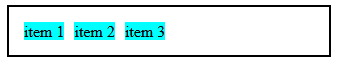

 

# Posicionando elementos com Flexbox em CSS

Neste curso estou aprendendo sobre o modelo de layout flexbox do CSS. Em cada aula eu criei arquivos separados que implementam diferentes características desse modelo.

## Propriedades

* `display: flex`

    O primeiro arquivo cria uma `div` que implementa a classe `.flex`. Esta, por sua vez, possui a propriedade `display: flex`. Isso significa que qualquer tag que estiver dentro dessa `div` estará distruibuída automaticamente ao longo desse espaço, independentemente do tamanho da tela.

    